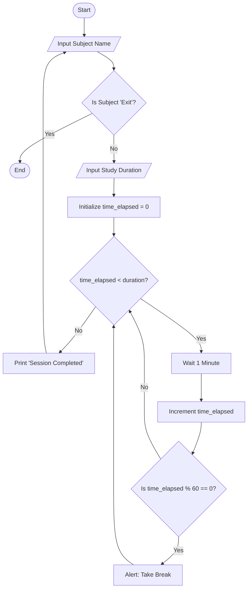

# Assignment 05: Career Planning, Certifications & Industry Readiness

**Name:** [Your Name]
**Programme:** B.Tech CSE (Specialization in AI & Robotics)
**Semester:** 1
**Course Code:** ETCCCP105
**Faculty:** [Faculty Name]

---

## 2.1 Step 1 – Computational Thinking in Action (CO1)

### Problem Definition
**System:** Study Planner with Task Reminder
**Goal:** To help students manage their study schedule efficiently by allowing them to input subjects, set study durations, and receive reminders. The system checks if the allocated time for a subject is completed and suggests breaks.

### Algorithm (Pseudocode)
```text
START
    DECLARE subject_list AS List
    DECLARE study_duration, time_elapsed AS Integer

    PRINT "Welcome to Study Planner"
    
    WHILE True DO
        PRINT "Enter Subject Name (or 'Exit' to stop):"
        INPUT subject
        
        IF subject == "Exit" THEN
            BREAK Loop
        END IF
        
        ADD subject TO subject_list
        PRINT "Enter study duration for " + subject + " (in minutes):"
        INPUT study_duration
        
        SET time_elapsed = 0
        
        WHILE time_elapsed < study_duration DO
            WAIT 1 minute
            INCREMENT time_elapsed by 1
            
            IF time_elapsed % 60 == 0 THEN
                PRINT "Reminder: Take a 5-minute break!"
            END IF
        END WHILE
        
        PRINT "Session for " + subject + " completed!"
    END WHILE

    PRINT "All study sessions completed. Good job!"
END
```

### Flowchart
*(Note: You can use Draw.io to create this based on the logic above. A text representation is below.)*



---

## 2.1 Step 2 – Linux and Automation Practice (CO2)

### 10 Key Linux Commands
1.  `pwd`: Print Working Directory - Shows the current path.
2.  `ls -l`: List Files - Shows files with detailed permissions.
3.  `mkdir Projects`: Make Directory - Creates a new folder named 'Projects'.
4.  `cd Projects`: Change Directory - Moves into the 'Projects' folder.
5.  `touch file.txt`: Create File - Creates an empty file named 'file.txt'.
6.  `chmod 755 file.txt`: Change Mode - Sets read/write/execute permissions.
7.  `cp file.txt backup.txt`: Copy - Copies the file.
8.  `mv backup.txt ../`: Move - Moves the file to the parent directory.
9.  `rm file.txt`: Remove - Deletes the file.
10. `history`: History - Shows the list of previously executed commands.

### Bash Script Execution
**Script Name:** `career_setup.sh`
**Purpose:** Automates the creation of a career portfolio folder structure (Resume, Certifications, Projects) and checks system uptime.

*(Insert Screenshot of script execution here)*

---

## 2.2 Step 3 - Exploring Emerging Technology Domain (CO3)

### Domain: Artificial Intelligence (AI) & Machine Learning (ML)

**Technology Overview:**
AI involves creating systems capable of performing tasks that typically require human intelligence, such as visual perception, speech recognition, and decision-making. Robotics combines AI with engineering to build physical machines that can interact with the world.

**Job Roles & Salary Trends (India):**
*   **AI Engineer:** ₹8 LPA - ₹25 LPA
*   **Data Scientist:** ₹7 LPA - ₹20 LPA
*   **Robotics Process Automation (RPA) Developer:** ₹5 LPA - ₹15 LPA
*   **Machine Learning Engineer:** ₹9 LPA - ₹30 LPA

**Relevant Certifications:**
1.  **Deep Learning Specialization** (Coursera/DeepLearning.AI)
2.  **AI & Machine Learning Nanodegree** (Udacity)
3.  **TensorFlow Developer Certificate** (Google)


## 2.3 Step 4 - Career Planning & Professional Readiness (CO4)

### Step 1: SMART Goals

1.  **Short-term (0-6 Months):**
    *   **Goal:** Complete the "Python for Everybody" specialization on Coursera and build 2 mini-projects.
    *   **Measurable:** Earn the certificate and push code to GitHub.
    *   **Relevance:** Builds the foundation for AI/ML.

2.  **Medium-term (6-18 Months):**
    *   **Goal:** Secure a summer internship in a Data Science or AI-related role.
    *   **Measurable:** Apply to 20 companies and secure at least 1 offer.
    *   **Relevance:** Provides practical industry experience.

3.  **Long-term (18-48 Months):**
    *   **Goal:** Graduate with a B.Tech degree with a CGPA of 8.5+ and land a job as a Junior AI Engineer.
    *   **Measurable:** Final Degree and Job Offer Letter.
    *   **Relevance:** Starts the professional career in the desired domain.

### Step 2: Certification Research

**Certification 1: AWS Certified Machine Learning – Specialty**
*   **Provider:** Amazon Web Services (AWS)
*   **Duration:** 2-3 months (Self-paced study)
*   **Cost:** ~$300 USD
*   **Skills:** ML model building, training, tuning, and deployment on AWS.
*   **Alignment:** Validates cloud-based AI skills, crucial for modern AI engineering roles (Long-term goal).

**Certification 2: Google Data Analytics Professional Certificate**
*   **Provider:** Google (via Coursera)
*   **Duration:** 6 months (at 10 hours/week)
*   **Cost:** Subscription based (~₹3000/month)
*   **Skills:** Data cleaning, analysis, visualization (R, SQL, Tableau).
*   **Alignment:** essential for understanding data processing before applying ML algorithms (Short/Medium-term goal).

### Step 3: LinkedIn Update
*   **Profile Picture:** Professional headshot added.
*   **Summary:** "Aspiring AI & Robotics Engineer | B.Tech CSE Student | Passionate about Python and Automation."
*   **Skills Added:** Python, C++, Data Structures, Linux.

*(Insert Screenshot of LinkedIn Profile here)*
*Profile URL: [Your LinkedIn URL]*

### Step 4: Hackathon/Open Source Plan
*   **Event:** Smart India Hackathon (SIH) 2024 / HackOctoberfest
*   **Date:** October 2024
*   **Preparation:**
    1.  Form a team of 4 members.
    2.  Brainstorm ideas related to "Smart Education" or "Healthcare".
    3.  Practice Git/GitHub workflow.

### Step 5: Career Roadmap (500-800 Words)

**Introduction**
My career roadmap is designed to transition me from a computer science student to a proficient AI & Robotics Engineer. This journey involves a strategic blend of academic excellence, skill acquisition, practical application, and professional networking.

**Year 1: Foundation & Exploration**
The focus of the first year is to build a strong programming foundation. I will master C++ and Python, as they are the core languages for competitive programming and AI respectively.
*   **Milestones:**
    *   Complete "Introduction to Programming" with an 'A' grade.
    *   Learn Linux basics and version control (Git).
    *   Participate in college-level coding contests to improve logic building.

**Year 2: Skill Specialization**
In the second year, I will dive deeper into Data Structures and Algorithms (DSA) and start exploring core AI concepts.
*   **Milestones:**
    *   Complete a comprehensive DSA course (LeetCode/GeeksforGeeks).
    *   Start the "Machine Learning" course by Andrew Ng.
    *   Build a "Chatbot" or "Image Classifier" project.
    *   **Certification:** Google Data Analytics Certificate.

**Year 3: Practical Application & Internships**
This is the most critical year for gaining industry exposure. I will focus on applying my skills to real-world problems.
*   **Milestones:**
    *   Secure an internship in Data Science or Web Development.
    *   Publish a research paper or technical blog.
    *   Participate in a major hackathon like SIH.
    *   **Certification:** AWS Certified Cloud Practitioner (to understand deployment).

**Year 4: Professional Launch**
The final year is dedicated to the capstone project and job placement.
*   **Milestones:**
    *   Develop a complex Capstone Project (e.g., Autonomous Drone Navigation).
    *   Prepare for technical interviews (System Design, Advanced DSA).
    *   Network aggressively on LinkedIn.
    *   **Goal:** Secure a placement as a Graduate Engineer Trainee or Junior AI Engineer.

**Conclusion**
By following this structured roadmap, I aim to not only acquire technical expertise but also develop the soft skills and professional network necessary for a successful career in the rapidly evolving field of Artificial Intelligence.

---

## 3. Reflection Section

**Challenges Faced:**
The most challenging part of this assignment was designing the algorithm for the study planner. Breaking down a human activity into logical steps required careful thought about edge cases (e.g., what if the user types invalid input?). Additionally, selecting the right certifications from the vast number of options available was overwhelming.

**Skills Improved:**
I significantly improved my **Linux command-line skills** by practicing file permissions and scripting. Writing the **SMART goals** forced me to be realistic and specific about my career ambitions, moving away from vague ideas to concrete plans. I also learned how to structure a professional **CV and LinkedIn profile**.

**Application:**
I will apply the **computational thinking** approach to break down complex coding problems in my upcoming semester. The **Linux skills** will be directly useful in my Operating Systems course. Most importantly, the **Career Roadmap** will serve as a guide for my extracurricular learning, ensuring I stay on track to become an AI Engineer.

---

**GitHub Link:** [Insert your GitHub Repository Link Here]
